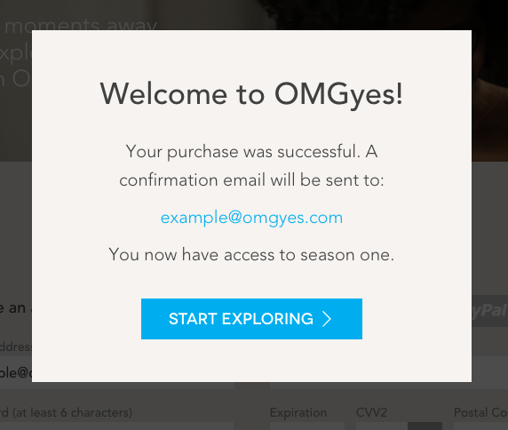
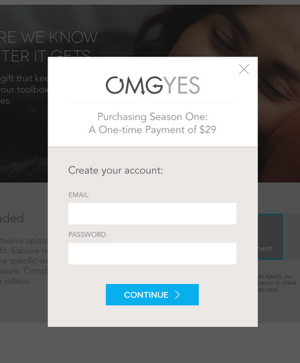
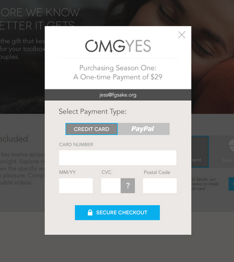
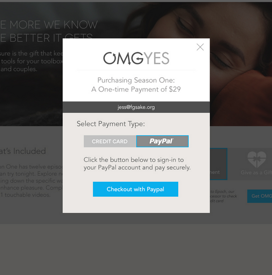

# Come explore with us

This project contains a portion of our site code. It shows the site's front-page (more or less), and supports a
checkout flow by clicking the `GET OMGYES` button.

It uses a build system that's fairly similar to the one on our existing site. If you find it difficult to work with,
you're welcome to change it.

## Installation

To create a development environment, you'll need to install [VirtualBox](https://www.virtualbox.org/wiki/Downloads), and [Vagrant](https://www.vagrantup.com/docs/installation/). (See links for downloads and installation instructions).

VirtualBox allows you to run virtual machines on your host operating system. Vagrant is a convenient way to distribute a
virtual machine image that is set up with all of the necessary tools for development.

When setup is complete, you'll have a Debian Jessie VM with the tools needed to build and run the example site.

### To install:
 1. Install VirtualBox and Vagrant, using the links above
 2. Check out this project using Git
 3. In your shell, change to the project directory
 4. Start the VM using `vagrant up`. On initial boot, it will take up to 10-15 minutes to download and install dependencies
 in the guest OS.
 5. Create a `checkout.cfg` file by copying `checkout.cfg.sample` over and replacing it with the values we give you. (You should have gotten these in your intro.)
 
 
### Custom installation:
This is optional, and not recommended, but if you don't want to use the provided VM for development, you can
build this project on your host machine. You'll need:
 - Python 3.4.x or higher
 - Ruby 3.1.x or higher, with gem support
 - Java 7 or higher
 - Node 6 or higher, with npm
 - Grunt (`npm install -g grunt-cli`)
 - Sass & Compass (`gem install sass compass`)

Then, install the Python requirements -- either globally, or inside a virtualenv:

    cd ~/checkout
    pip install -r requirements.txt
    
Finally, install the JavaScript requirements:

    cd ~/checkout/grunt
    npm install

## Usage
 You can access the VM by using the `vagrant ssh` command. The username is `vagrant`; the passwords for `vagrant` and `root`
 are both `checkout`. You can also use `sudo` without a password.
 
 The site's files are available in the `checkout` directory inside the VM. That means you can use your favorite editor on
 the code in this directory, and it will be available to the server and build code inside the VM.
 
 Be sure to make all of your changes in a feature branch.
 
 To run the web server:

    cd ~/checkout
    ./checkout.py

 You can then view the site at [http://localhost:5454/](http://localhost:5454/) in your browser.
 
 JavaScript files are combined and minified using the [Closure Compiler](https://developers.google.com/closure/compiler/).
 CSS is preprocessed using [Sass](http://sass-lang.com/), and then minified using [clean-css](https://github.com/jakubpawlowicz/clean-css).
 
 If you make changes, you'll need to rebuild the relevant files:
 
    cd ~/checkout/grunt
    grunt js

(or `grunt css`, or `grunt all` if you changed both)

**You'll need to run `grunt all` at least once after installation to view the site properly.**

## Tasks
We're asking candidates to complete as many of the tasks below as possible. They are listed in approximate order of
complexity.

 1. The bottom of the play button on the front page gets cut off at browser widths ≤ 500px. Change the layout of the text above to make room at the bottom.
 2. On the front page, the "Why I Participated" video image has a gap below it at browser widths ≥1280px. Remove the
 gap, so it touches the bottom nav bar like at other browser widths.
 3. During checkout, the submit button's text disappears once it actually starts submitting to the backend server,
 and the button changes to a very narrow rectangle. Add the text `Submitting...` to the button, so it displays properly.
 4. The Paypal and Twitter icons on the front page are implemented as embedded SVGs. They are each repeated in the page
 3 times. Add a partial template for each icon, and include it in the relevant places on the front page.
 5. <a name="confirm"></a>After checkout, a modal should display, something like:
 
 

use the `$modal` service passed into the `checkout` controller. It can be called like this:
```javascript
var parent = $scope;
$modal.open({
   templateUrl: '/confirm-modal',
   backdrop: 'static',
   keyboard: false,
   scope: parent,
   controller: ['$scope', function ($scope) {
       $scope.email = ''; // TODO: get email from checkout data
       $scope.continue = function () {
           // TODO: redirect to success page
       };
   }]
});
```
The button on the modal should send the user to the success page. You can find documentation on the modal service
[here](https://github.com/angular-ui/bootstrap/tree/master/src/modal/docs).


### Second Round Task
If all goes well on the preceding tasks, we will ask you to change the checkout flow to an entirely modal checkout on
the front page. **Don't do this until we've discussed the first set of tasks.**

Once complete, it would look something like the following:

 
 
 
 
 

Followed by a confirmation screen, same as in [Task 5](#confirm)

## Submitting
Once you've made your changes, and you wish to submit the code, follow these instructions:
 1. Make sure all changes are committed on your feature branch.
 2. Create a mailable patch file: `git format-patch master --stdout > submission.patch`
 3. Attach the patch file to an email sent to [dev@omgyes.com](mailto:dev@omgyes.com?Subject=Dev%20task)

## Cleanup
Once you're done, you can remove the VM using `vagrant destroy`. You can also remove the base box by running `vagrant box remove minimal/jessie64`.

## Questions?
If you have any questions about these tasks, don't hesitate to contact us at [dev@omgyes.com](mailto:dev@omgyes.com?Subject=Dev%20task)
